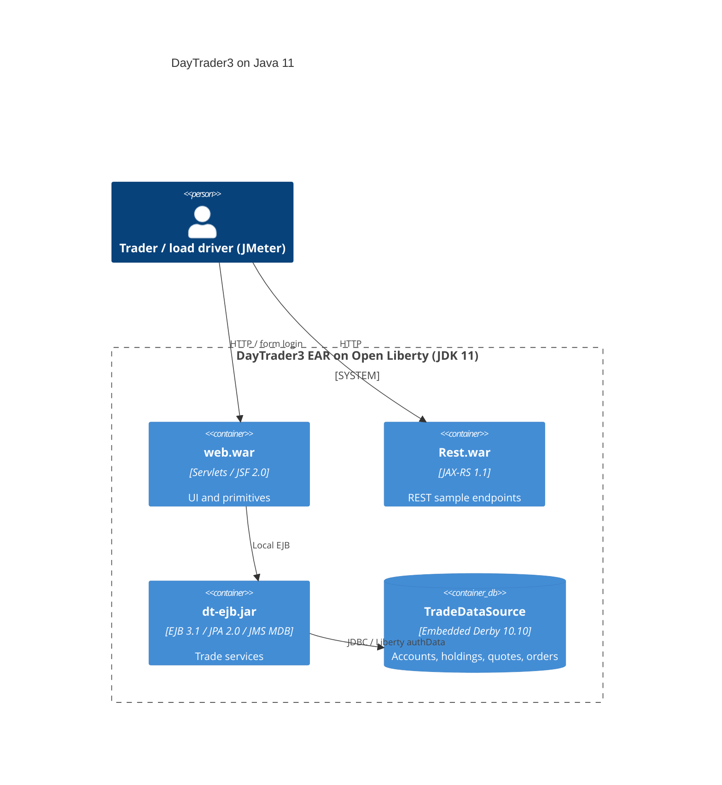

# 0001. Upgrade DayTrader3 build and runtime target to Java 11

- **Status:** Proposed
- **Date:** 2026-09-24
- **ARB ticket:** TO BE CREATED
- **Authors:** Devin (on behalf of the requesting team)
- **Owning team:** TBD — repository maintainers (COG-GTM/sample.daytrader3)
- **Related ADRs:** none (first ADR in this repository)

## Context

DayTrader3 is a Java EE 6 benchmark sample (EJB + JSF/servlet web module + JAX-RS module,
packaged as an EAR) that runs on WebSphere Liberty / Open Liberty with an embedded Derby database.
The build targeted Java 1.7 (`sourceCompatibility = 1.7` in Gradle, `java7-parent` in Maven) and
CI used OpenJDK 8. Java 7/8 are past end of public updates, and Java 11 removed the Java EE
modules (`java.xml.bind`, `javax.annotation`) that the source relied on being present in the JDK,
so the project no longer compiles on a current LTS JDK without changes.

Constraints: no application source changes, no adoption of JPMS (`module-info.java`), keep both
the Maven and Gradle builds working, keep the Liberty server configuration unchanged.

ARB triggers: T7 (runtime/language major upgrade: Java 7 → Java 11). T3 flagged heuristically for
`javax.annotation-api` / `jaxb-api`, but these are standard Java EE API jars (provided scope,
supplied by Liberty at runtime) and make no network calls — treated as a false positive.

## Decision

We will compile and run DayTrader3 with Java 11: Maven compiles with `--release 11` and enforces
JDK 11+, Gradle sets source/target compatibility 11 via a committed Gradle 6.9.4 wrapper, the
removed Java EE APIs are supplied as `provided`-scope dependencies (`javax.annotation-api:1.3.2`,
`jaxb-api:2.3.1`), and CI builds on OpenJDK 11.

## Alternatives considered

| Alternative | Pros | Cons | Why rejected |
| --- | --- | --- | --- |
| Do nothing (stay on Java 7/8) | Zero effort | Unsupported JDK, cannot build on current toolchains, blocks later upgrades | Not viable long-term |
| Jump directly to Java 17/21 | Fewer future upgrades | Liberty Java EE 6 features / `javax.*` stack needs the same fixes plus more; larger risk in one step | Out of scope for this request; Java 11 is a stepping stone |
| Adopt JPMS (`module-info.java`) while upgrading | "Proper" Java 9+ modularity | Large refactor, no benefit for an EAR deployed on Liberty | Explicitly excluded by the request |

## Architecture

No component, data store, or external integration is added or changed; only the JDK used to
compile and run the existing components.

## Non-functional requirements

| NFR | Target | How met |
| --- | --- | --- |
| Availability SLO | N/A — benchmark sample, not a production service | |
| p95 latency | Unchanged from Java 8 baseline; TBD — owner to confirm before ARB | Same code, newer JIT |
| RPO / RTO | N/A — embedded Derby, data is regenerated via the app's populate action | |
| Peak load | Driven by the bundled JMeter scripts; unchanged | |
| Scaling model | Single Liberty server; unchanged | |
| Data retention | N/A | |

## Security & compliance

- **Data classification:** Synthetic benchmark data only; no PII.
- **Encryption at rest:** N/A — unchanged (embedded Derby on local disk).
- **Encryption in transit:** Unchanged (Liberty `httpsPort=9443` available).
- **AuthN / AuthZ:** Unchanged (Liberty `authData` for the datasource, app-level login).
- **Secrets:** Unchanged; no new secrets.
- **Audit logging:** Unchanged (Liberty messages.log).
- **Data residency / regions:** N/A.
- **Policy sections satisfied:** No infrastructure change; not applicable.
- **Threats considered:** Newer JDK receives security updates that Java 7/8 no longer do; the two
  added API jars are compile-time only (`provided`) and are not shipped in the EAR.

## Cost

| Item | Assumption | Monthly estimate |
| --- | --- | --- |
| JDK 11 runtime | Open-source OpenJDK, same host footprint | $0 |
| **Total** | | $0 |

## Operations

- **On-call rotation:** N/A — sample application.
- **Runbook:** `docs/Using-cmd-line.md`, `docs/Starting-the-server.md`.
- **Dashboards / alarms:** N/A.
- **Rollback plan:** Revert the PR; the previous build works on JDK 7/8.
- **Migration / cut-over plan:** Merge PR; developers install a Java 11 JDK; CI already switched.

## Policy exceptions requested

| Rule | Resource | Justification | Compensating control | Expiry |
| --- | --- | --- | --- | --- |
| none | | | | |

## Consequences

- Positive: builds on a supported LTS JDK; unblocks future Liberty / Jakarta EE upgrades.
- Negative / risks: Gradle build still uses legacy `compile`/`providedCompile` configurations and
  liberty-gradle-plugin 2.4, so it is pinned to Gradle 6.x until a follow-up modernises it.
- Follow-ups: migrate Gradle scripts to `implementation`/`compileOnly` and a current
  `io.openliberty.tools` plugin; consider Java 17.

## Open questions

- Owning team and on-call contact to be confirmed by repository maintainers.
